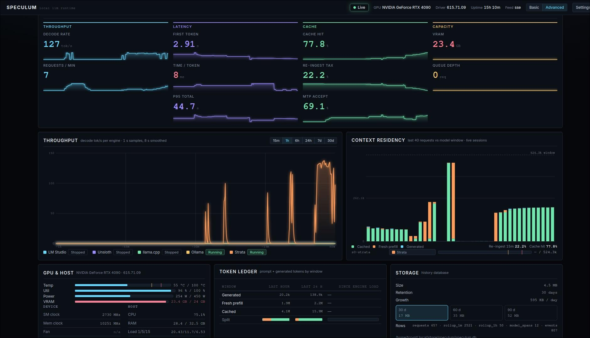

# Speculum

Speculum watches a local LLM runtime and draws it on one page. It runs on the box doing the work: one RTX 4090 serving models through llama-swap, with engine backends such as NInfer, Strata, Ollama, vLLM, LM Studio, Unsloth Studio, or any OpenAI-compatible endpoint. A Python collector polls the sources and serves the panels plus a 1 Hz feed.



Jump to: [Quick start](#quick-start) · [What the page shows](#what-the-page-shows) · [What it watches](#what-it-watches) · [Configuration](#configuration) · [Demo mode](#demo-mode) · [How it works](#how-it-works) · [HTTP API](#http-api) · [Files](#files) · [Development](#development)

## Quick start

Python 3.9 or newer is the whole requirement. The collector runs on the standard library, and the front end is plain HTML, CSS and ES modules. You install nothing and build nothing. A TOML config file needs 3.11+, because `config.py` reads it with `tomllib`.

Run the collector from the repo root. It serves the static files and the feed:

```sh
python3 collector/speculum.py            # → http://127.0.0.1:8792/
```

Open `http://127.0.0.1:8792/`. Panels fill as the collector finds sources. A source that stays down shows an honest "no data", and the page keeps running.

The collector binds `127.0.0.1:8792` only. To watch it from another machine, publish tailnet-only with `tailscale serve`. LAN and public exposure stay out.

### Linux: run it 24/7

```sh
cp collector/speculum.service ~/.config/systemd/user/
systemctl --user daemon-reload
systemctl --user enable --now speculum
journalctl --user -u speculum -f
```

The unit assumes the checkout sits at `~/speculum`; point `ExecStart` elsewhere if yours lives somewhere else. It sets `CUDA_VISIBLE_DEVICES=` so the CUDA context stays with llama-swap, caps the process at `MemoryMax=64M`, and runs at nice 10.

### Windows

Use the same command with `python` instead of `python3`:

```sh
python collector\speculum.py             # → http://127.0.0.1:8792/
```

Python 3.11+ from python.org covers the config file; 3.9–3.10 runs without one. Host metrics come from the Win32 API through `collector/hostinfo.py`: CPU, RAM plus page file, uptime, top engine processes. Load average reads n/a there. `nvidia-smi` on PATH gives the same GPU readings as on Linux.

For 24/7, create a Task Scheduler task. Action: `pythonw.exe <repo>\collector\speculum.py`. Start in the repo root, run whether the user is logged on or not, restart on failure. The history database lives in `%LOCALAPPDATA%\Speculum\speculum.db`, and an optional config file in `%APPDATA%\Speculum\speculum.toml`.

### Running the collector away from the GPU box

The collector is an HTTP client, so it can run in a Proxmox LXC or another container pointed at the GPU box. Add hosts under `[discovery]`:

```toml
[discovery]
enabled = true
targets = ["10.0.0.41", "gpu-box.lan"]
```

Discovery probes localhost first, so a local engine wins its own port. Claims are keyed on host:port, which keeps a remote 8080 discoverable while a local 8080 is taken. Remote probes use the 2 s timeout instead of the 0.3 s localhost timeout. A container without a GPU degrades cleanly: the GPU thread hits an OSError on `nvidia-smi`, marks the GPU absent, warns once, and the panels show "no data".

## What the page shows

The top bar carries the overall state (Live, Degraded, Offline), GPU name, driver, host uptime, feed type, the view toggle and the settings menu. An alert strip appears under the bar while an alert holds, for example an engine latched red after a run of "service unavailable".

The deck holds twelve panels:

| Panel | Shows |
|---|---|
| **KPI** | ten metrics in four groups: Throughput (decode rate — which names the model it tracks, requests/min), Latency (first token, time per token, p95), Cache (hit rate, re-ingest tax, MTP acceptance), Capacity (VRAM, queue depth). Each carries a 60-min sparkline and a delta against 15 min ago. |
| **Throughput** | rolling decode tok/s, one trace per engine, 15 min to 30 d. Ranges past 1 h read from the history database. |
| **GPU & host** | meters for temperature, utilisation, power draw and VRAM, with warn/crit ticks from the real power limit and VRAM total. Device readouts (SM and memory clock, fan, PCIe) plus host CPU, RAM, load and top processes. |
| **Context** | one bar per live session: prompt tokens against the model window, ticks at 75 % and 90 %. |
| **Model timeline** | which model sat on which engine over time, 6 h to 30 d. Spans survive collector restarts. |
| **Token ledger** | generated, fresh and cached token volume over the last hour, the last 24 h and since engine start, with per-column mix bars. |
| **Storage** | database size, retention, what longer retention would cost, CSV export, prune now. |
| **Requests** | recent inferences: model, prompt against window with the cached/fresh split, window, TTFT, decode rate. |
| **Leaderboard** | per-model requests, output tokens, median decode, cache hit, MTP and tokens per Wh, 6 h to 30 d. |
| **Engines** | one card per engine: state, origin, window, backend, decode rate, queue, MTP, history sparkline. A stopped engine dims with its reason. |
| **Events** | runtime event stream: request completions, engine lifecycle, warnings, alerts. Severity filters and pause-autoscroll. |
| **KV pool** | one cell per live KV slot, fill = prompt tokens against window. |

Basic shows five panels: KPI, throughput, GPU & host, model timeline, engines. Advanced shows all twelve. You can bookmark either with `?view=basic|advanced`.

Settings live in the top-bar menu and persist in the browser: theme (dark default, light), reduce motion (follows the OS preference, or forced on/off), ripple (off by default).

`P` pauses the paint loop. `R` reseeds the demo or resyncs live data.

A feed silent for more than 10 s puts an amber chip in every panel header. The data stays visible and marked. The top-bar pill reads Offline when the feed drops.

## What it watches

Every source is optional. Each poll degrades to "no data".

| Source | Feeds |
|---|---|
| `nvidia-smi` (one long-lived `-lms 1000` subprocess, read line by line) | GPU name and driver, temperature, utilisation, power, VRAM |
| `collector/hostinfo.py` (`/proc` on Linux, Win32 on Windows) | host CPU total and per core, RAM plus page file, load (n/a on Windows), uptime, top engine processes |
| llama-swap `:9090` (`/running`, `/v1/models`, `/api/metrics/activity`, `/api/events`, `/logs/stream/<model>`) | models in use, per-request records (cached against fresh prompt, outputs, TTFT), event stream |
| NInfer backend (port from llama-swap `/running`, for example `:5803`), reading `/metrics`, `/slots` and the log stream | decode and prefill tok/s, KV slots, per-request TTFT, queue, prefill, decode, MTP, engine latch alerts |
| Strata `:8080` (`/v1/models`, `/metrics`, `/slots`) | second engine plus context slots |
| any engine in `speculum.toml` | the same fields through the pluggable adapters |

## Configuration

Config is optional. With no file, Speculum probes the default ports on localhost and shows what it finds. Copy `speculum.example.toml` to `speculum.toml` in the repo root or in `~/.config/speculum/` to change anything.

```toml
[server]
host = "127.0.0.1"
port = 8792

[history]
retention_days = 30        # 30, 60, 90, or 0 to turn history off

[[engine]]
name = "ollama-desk"
type = "ollama"
url  = "http://10.0.0.41:11434"
```

The file sets the bind address and port, discovery targets, history retention, alert thresholds, and engine adapters on any host. Discovery probes localhost first, so a local engine wins its own port. `api_key_env` names the environment variable holding a bearer token; Speculum sends it as `Authorization` and keeps the secret out of the file.

Adapters: `ollama`, `llamacpp`, `vllm`, `sglang`, `freetoken`, `koboldcpp`, `tabbyapi`, `localai`, `lmstudio`, `unsloth`, `openai`, `custom`. [`docs/ENGINE-COVERAGE.md`](docs/ENGINE-COVERAGE.md) explains how each adapter recognises a server and which engines stay unsupported.

## Demo mode

`?demo` runs a seeded simulation with no backend. Serve the repo root any way you like and open `http://localhost:8792/?demo`:

```sh
python3 -m http.server 8792
```

The simulator fills the same state shape as live data, so the paint loop and every panel behave identically. Demo numbers are invented on purpose, and `R` reseeds them.

## How it works

```
nvidia-smi · host metrics (hostinfo.py) · llama-swap :9090 · NInfer backend · Strata :8080 · other engines
        │  (each optional; every poll degrades to "no data")
        ▼
collector/speculum.py   one Python 3 process, daemon poll threads,
                        one shared state under one lock
        │
        ├─ static files from the repo root
        ├─ GET /api/snapshot   one-shot full JSON
        └─ GET /api/stream     SSE: 1 Hz tick (hot values + new events/requests)
        ▼
app.js   EventSource with snapshot-poll fallback; paint loop; all panels
```

The collector keeps bounded in-memory buffers: 60 minutes of GPU, host and KPI samples at 1 Hz, the last 500 requests, the last 200 events. `collector/history.py` writes the long view to SQLite: per-request rows, minute and hour rollups, model load spans, events, with daily pruning at the configured retention. Views longer than one hour read from that database, so the page works across collector restarts.

## HTTP API

| Endpoint | Purpose |
|---|---|
| `GET /api/snapshot` | one-shot full JSON (state plus history) |
| `GET /api/stream` | SSE: 1 Hz `tick` plus push events |
| `GET /api/history?range=…` | rollup rows, minute and hour |
| `GET /api/requests?range=…` | raw request rows, capped at 1000 |
| `GET /api/spans?range=…` | model load spans |
| `GET /api/leaderboard?range=…` | per-model statistics |
| `GET /api/storage` | database size, retention, projections |
| `GET /api/export?range=…&format=csv` | CSV export |
| `POST /api/prune` | apply retention now |

## Files

| File | Role |
|---|---|
| `index.html` | page shell: top bar, twelve panel shells, footer, one module script |
| `tokens.css` · `components.css` · `layout.css` | design tokens (dark and light themes, WCAG AA), UI primitives, layout. No framework, no build. |
| `app.js` | feed (SSE plus poll fallback), `?demo` simulator, paint loop, all panels |
| `ui.js` · `viewmodel.js` · `ripple.js` | DOM primitives and formatters, pure view-model adapters, optional ripple effect |
| `collector/speculum.py` | stdlib-only collector and HTTP server, one process |
| `collector/hostinfo.py` | host metrics, two backends: `/proc` on Linux, Win32 through ctypes on Windows |
| `collector/history.py` | SQLite history: writer thread, rollups, spans, storage and export API |
| `collector/engines.py` · `collector/config.py` | engine adapters plus the backoff scheduler, `speculum.toml` loader |
| `collector/speculum.service` | systemd `--user` unit (Linux; Task Scheduler on Windows) |
| `speculum.example.toml` | example configuration |
| `docs/ENGINE-COVERAGE.md` | supported engines, how each is recognised, what stays unsupported |
| `smoke/` | Node DOM-stub smoke tests, no browser needed |
| `LICENSE` | MIT license |

## Development

```sh
python3 -m py_compile collector/*.py                        # collector parses
python3 -m unittest discover -s collector -p "test_*.py"    # collector suite
node smoke/ui-primitives.mjs                                # primitives plus ripple state machine
node smoke/shell.mjs                                        # real app.js shell, view-model checks
python3 -m http.server 8792                                 # → http://localhost:8792/?demo
```

The UI files are ES modules, so `node --check` does not apply to them. The smoke scripts import and run them, which serves as the parse-and-run check.

The two `test_hostinfo.py` skips are platform gates: the `/proc` backend runs on Linux and the Win32 ctypes backend runs only on Windows. On a Linux box the Windows path is read, not executed, so its numbers stay unverified until you run the suite on Windows.

## Origin

A local model generated the first version in one agent turn on 2026-10-03, on the RTX 4090 box that serves the models through llama-swap and NInfer. Every iteration since then ran on that box.

## License

MIT. See `LICENSE`.
