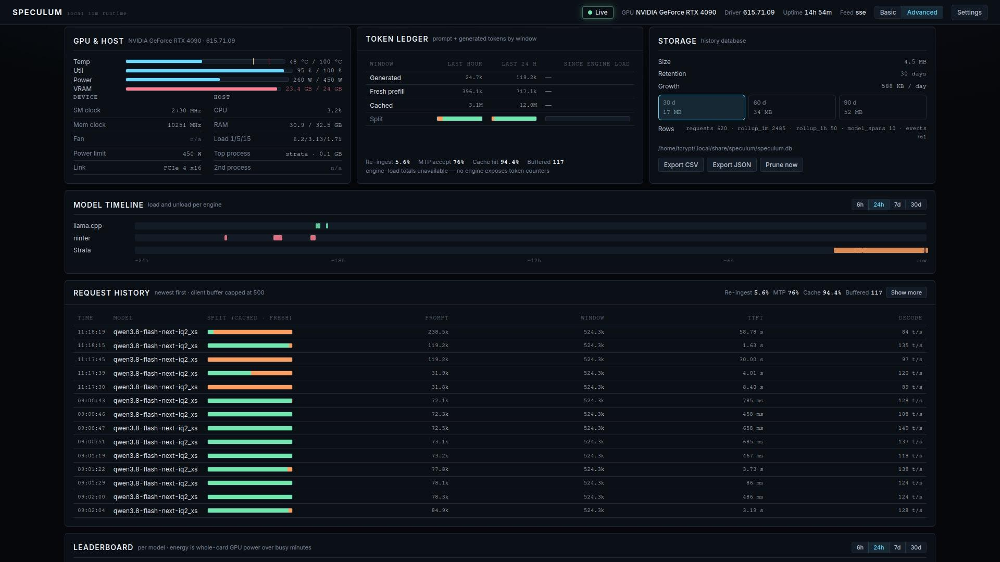
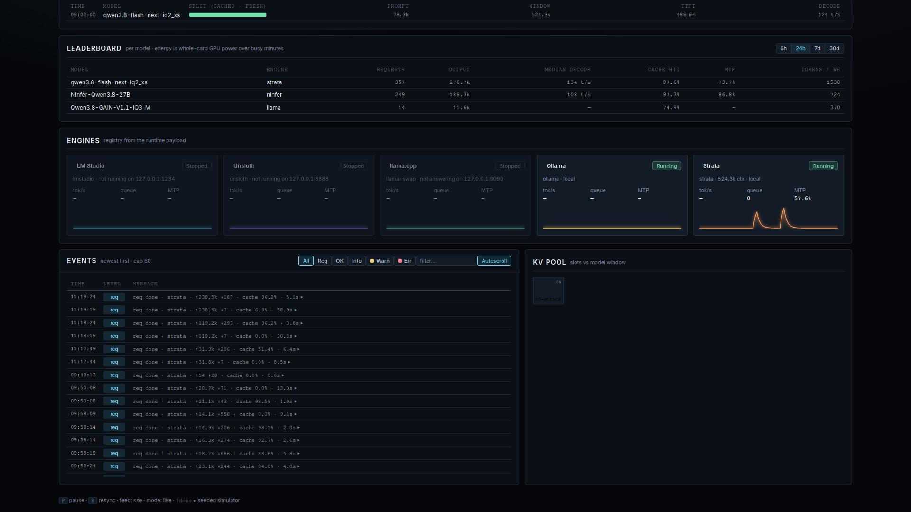
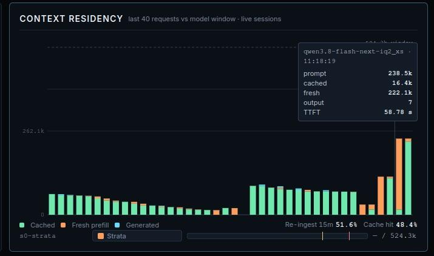
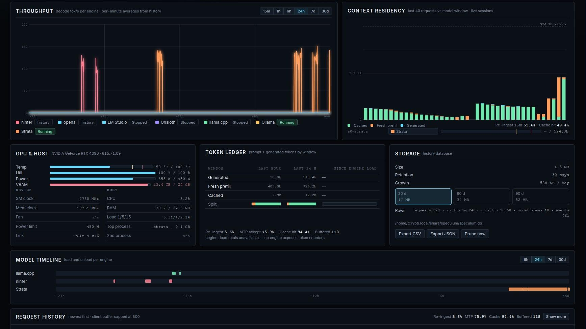
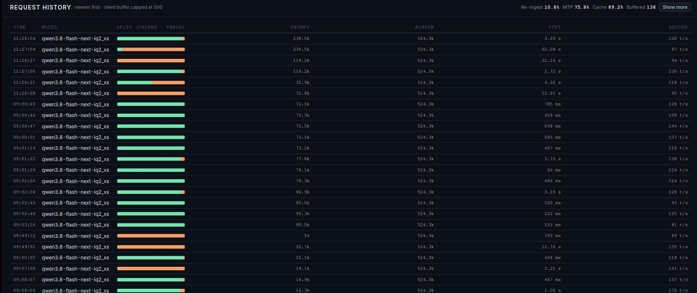
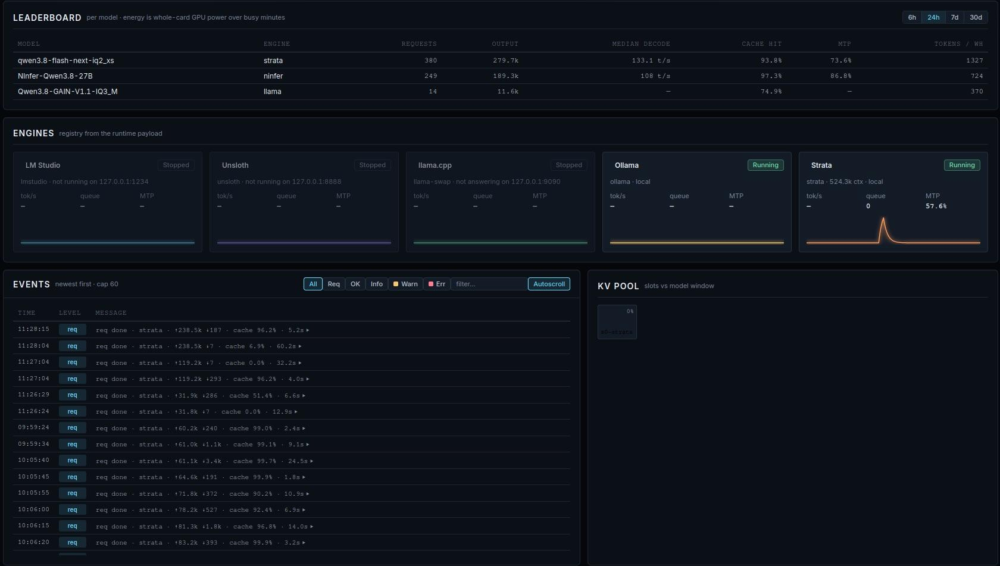

# Speculum

A lightweight observability dashboard for a local LLM runtime.

Speculum runs on the box doing the work. It watches a local LLM stack — one
GPU serving local models through llama-swap, plus engine backends such as
NInfer or Strata (or Ollama, vLLM, LM Studio, Unsloth Studio, any
OpenAI-compatible or custom endpoint) — and renders everything on one page,
refreshed at 1 Hz:


- **No build step, no dependencies.** The front end is plain HTML, CSS and ES
  modules; the collector is one Python 3 process using only the standard
  library. Nothing to `pip install`, nothing to compile.
- **No infrastructure.** The only storage is an optional local SQLite file.
- **Local by design.** Binds `127.0.0.1` only. Off-box viewing goes through
  `tailscale serve` (tailnet-only) — never to the LAN or the public internet.
- **Honest degradation.** Every source is optional. A down engine or backend
  shows as an honest "no data" — never a fabricated number, and never enough
  to take the page down.

## Quick start

All you need is Python 3.9 or newer (3.11+ only if you use a TOML config
file) — the collector is stdlib-only, so there is nothing to install.

**Live** — the collector serves the static files and the feed:

```sh
python3 collector/speculum.py            # → http://127.0.0.1:8792/
```

For 24/7, run it as a systemd `--user` service:

```sh
cp collector/speculum.service ~/.config/systemd/user/
systemctl --user daemon-reload
systemctl --user enable --now speculum
journalctl --user -u speculum -f
```

The unit binds `127.0.0.1:8792` only, runs with `CUDA_VISIBLE_DEVICES=` (the
collector never touches the CUDA context — it reads `nvidia-smi` as one
long-lived subprocess) and a `MemoryMax=64M` ceiling. To view it off-box,
publish tailnet-only with `tailscale serve`.

The unit assumes the checkout is at `~/speculum` — if yours lives elsewhere,
point `ExecStart` at it.
**Windows** — the same command, `python` instead of `python3`:

```sh
python collector\speculum.py            # → http://127.0.0.1:8792/
```

Python 3.11+ from python.org (3.9–3.10 works without a `speculum.toml`).
Host metrics (CPU, RAM + page file, uptime; load average shows as n/a)
come from the Win32 API via `collector/hostinfo.py`; if `nvidia-smi` is
on PATH, GPU readings work exactly as on Linux.

For 24/7, schedule a Task Scheduler task instead of the systemd unit:
action `pythonw.exe <repo>\collector\speculum.py`, start in the repo
root, run whether the user is logged on or not, restart on failure. The
history database lives in `%LOCALAPPDATA%\Speculum\speculum.db`; an
optional config file in `%APPDATA%\Speculum\speculum.toml`.

**Configuration** is optional: copy `speculum.example.toml` to
`speculum.toml` (repo root or `~/.config/speculum/`) and edit. With no config
file, Speculum probes the default ports on localhost and shows what it finds.
The config sets the bind address/port, enables or disables discovery, sets the
history retention (30/60/90 days, or 0 to turn history off), and adds engine
adapters (`ollama`, `vllm`, `lmstudio`, `unsloth`, `openai`, `custom`) on any
host.

**Demo** — `?demo` runs a seeded simulation with no backend at all; serve the
directory any way you like (e.g. `python3 -m http.server 8792`) and open
`http://localhost:8792/?demo`. The simulator fills exactly the same state
shape as live data, so the page is identical in behaviour.

## How it works

```
nvidia-smi · host metrics (hostinfo.py) · llama-swap :9090 · NInfer backend · Strata :8080 · other engines
        │  (each optional; every poll degrades to "no data")
        ▼
collector/speculum.py   one Python 3 process, daemon poll threads,
                        one shared state under one lock
        │
        ├─ static files from the repo root
        ├─ GET /api/snapshot   one-shot full JSON
        └─ GET /api/stream     SSE: 1 Hz tick (hot values + new events/requests)
        ▼
app.js   EventSource with snapshot-poll fallback; paint loop; all panels
```

The collector keeps bounded in-memory buffers (60 min of GPU/host/KPI samples
at 1 Hz, the last 500 requests, the last 200 events), and `collector/history.py`
persists the long view into SQLite: per-request rows, minute/hour rollups,
model load spans and events, with daily pruning at the configured retention.
Long-range views (throughput, timeline, leaderboard beyond 1 h) are answered
from that database, so the page works across collector restarts.

## Screenshots

Captured live on the monitor box (dark theme; the settings menu also has a
light theme).













## What it watches

| Source | Feeds |
|---|---|
| `nvidia-smi` (one long-lived `-lms 1000` subprocess, read line by line) | GPU name/driver, temperature, utilisation, power, VRAM |
| `collector/hostinfo.py` (Linux: `/proc` · Windows: Win32) | host CPU (total + per core), RAM + page file, load (n/a on Windows), uptime, top engine processes |
| llama-swap `:9090` (`/running`, `/v1/models`, `/api/metrics/activity`, `/api/events`) | models in use, per-request records (cached vs fresh prompt, outputs, TTFT), event stream |
| NInfer backend (port from llama-swap `/running`, e.g. `:5803`) — `/metrics`, `/slots`, log stream | decode/prefill tok/s, KV slots, per-request TTFT/queue/prefill/decode/MTP, engine latch alerts |
| Strata `:8080` (`/v1/models`, `/metrics`, `/slots`) | second engine + context slots |
| any engine from `speculum.toml` | same, via the pluggable adapters |

## Panels

The top bar shows the overall state (Live / Degraded / Offline), GPU, driver,
host uptime, feed type, the view toggle and the settings menu; an alert strip
appears only while an alert is active (e.g. an engine latched red after a run
of "service unavailable"). The deck then holds twelve panels:

| Panel | Shows |
|---|---|
| **KPI** | ten live KPIs in four groups — Throughput (decode rate, requests/min), Latency (first token, time/token, p95), Cache (cache hit, re-ingest tax, MTP acceptance), Capacity (VRAM, queue depth) — each with a 60-min sparkline and a delta vs 15 min ago |
| **Throughput** | rolling decode tok/s, one trace per engine, ranges 15 min → 30 d (beyond 1 h from the history DB) |
| **GPU & host** | horizontal meters for temp, utilisation, power draw and VRAM (warn/crit ticks from the real power limit and VRAM total), plus device readouts (SM/mem clock, fan, PCIe) and host (CPU, RAM, load, top processes) |
| **Context** | one bar per live session: prompt tokens vs the model window, with 75 % / 90 % ticks |
| **Model timeline** | which model was loaded on which engine over time (6 h → 30 d; spans survive collector restarts) |
| **Token ledger** | generated / fresh / cached token volume over the last hour, last 24 h and since engine start, with per-column mix bars |
| **Storage** | history database size, retention, what longer retention would cost; CSV export and prune-now |
| **Requests** | recent inferences: model, prompt vs window (cached vs fresh), window, TTFT, decode rate |
| **Leaderboard** | per-model requests, output tokens, median decode, cache hit, MTP and tokens per Wh (6 h → 30 d) |
| **Engines** | one card per engine: state, origin, window, backend, decode rate, queue, MTP, history sparkline; dimmed with a reason when stopped |
| **Events** | runtime event stream (request completions, engine lifecycle, warnings, alerts) with severity filters and pause-autoscroll |
| **KV pool** | one cell per live KV slot, fill = prompt tokens vs window |

**Views.** The top bar toggles **Basic** (KPI, throughput, GPU, timeline,
engines) and **Advanced** (everything); the choice is bookmarkable via
`?view=basic|advanced`. **Settings** (top-bar menu) persist in the browser:
theme (dark default / light), reduce motion (follows the OS preference, or
forced on/off), and the optional ripple effect (off by default).

Keys: `P` pause · `R` reseed (demo) / resync (live).

## HTTP API

| Endpoint | Purpose |
|---|---|
| `GET /api/snapshot` | one-shot full JSON (state + history) |
| `GET /api/stream` | SSE: 1 Hz `tick` plus push events |
| `GET /api/history?range=…` | rollup rows (minute/hour) |
| `GET /api/requests?range=…` | raw request rows |
| `GET /api/spans?range=…` | model load spans |
| `GET /api/leaderboard?range=…` | per-model statistics |
| `GET /api/storage` | database size, retention, projections |
| `GET /api/export?range=…&format=csv` | CSV export |
| `POST /api/prune` | apply retention now |

## Files

| File | Role |
|---|---|
| `index.html` | page shell: top bar, twelve panel shells, footer, one module script |
| `tokens.css` · `components.css` · `layout.css` | design tokens (dark + light themes, WCAG AA) · UI primitives · layout — no framework, no build |
| `app.js` | feed (SSE + poll fallback), `?demo` simulator, paint loop, all panels |
| `ui.js` · `viewmodel.js` · `ripple.js` | DOM primitives and formatters · pure view-model adapters · optional ripple effect |
| `collector/speculum.py` | stdlib-only collector and HTTP server (Python 3, one process) |
| `collector/hostinfo.py` | host metrics, two backends: `/proc` on Linux, Win32 via ctypes on Windows |
| `collector/history.py` | SQLite history: writer thread, rollups, spans, storage/export API |
| `collector/engines.py` · `collector/config.py` | engine adapters + backoff scheduler · `speculum.toml` loader |
| `collector/speculum.service` | systemd `--user` unit (Linux; on Windows: Task Scheduler) |
| `speculum.example.toml` | example configuration |
| `smoke/` | Node DOM-stub smoke tests (no browser needed) |
| `LICENSE` | MIT license |

## Development

```sh
python3 -m py_compile collector/speculum.py    # collector parses
node smoke/ui-primitives.mjs                   # primitives + ripple state machine
node smoke/shell.mjs                           # boots the real app.js shell over real payload shapes
python3 -m http.server 8792                    # → http://localhost:8792/?demo (simulator)
```

The UI files are ES modules, so `node --check` does not apply to them; the
smoke scripts import and execute them, which is the parse-and-run check.
Demo values are deliberately invented — that is the simulator's job.

## Origin

Speculum started on 2026-10-03 as a prototype generated in a single agent
turn on a local model — one RTX 4090 box serving local models through
llama-swap and NInfer — and has been iterated on that same box since.

## License

MIT — see `LICENSE`.
